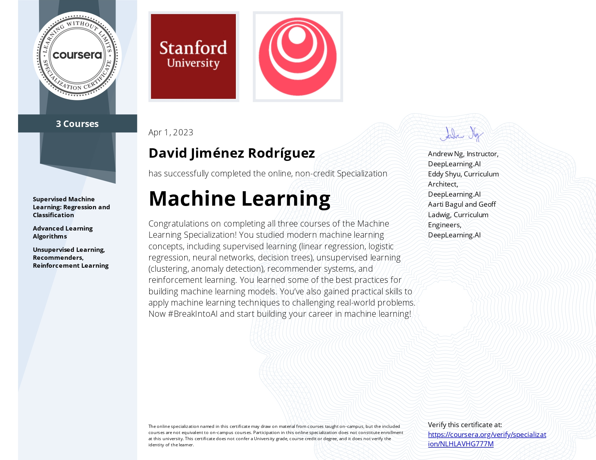
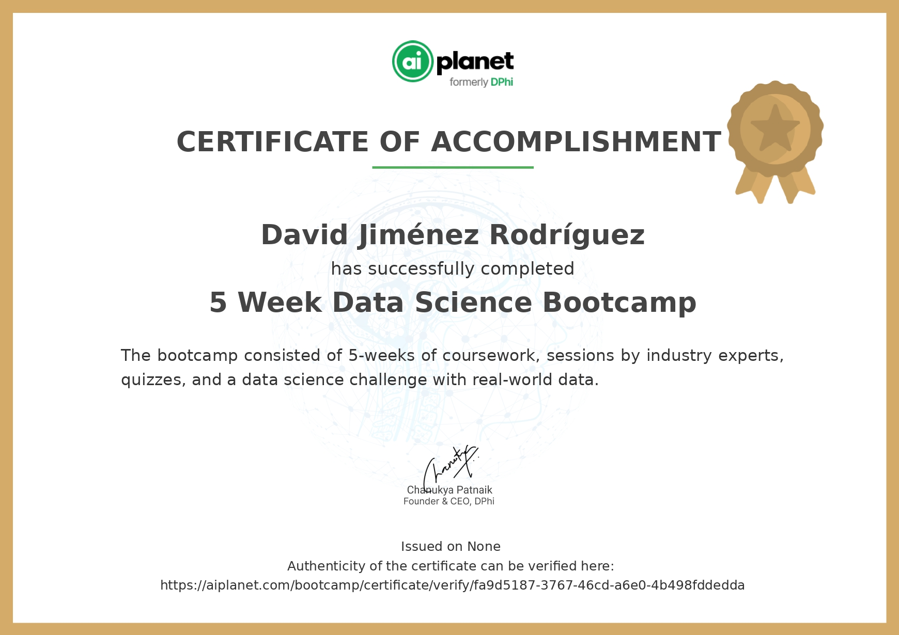
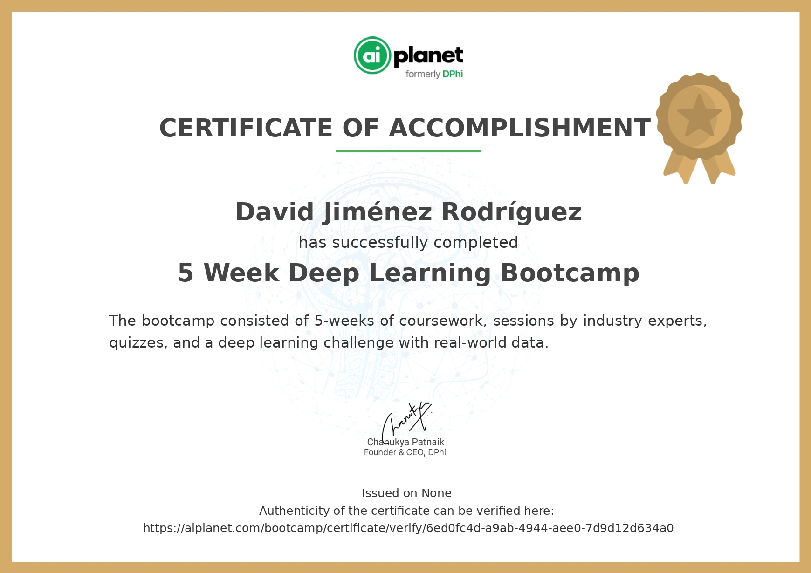
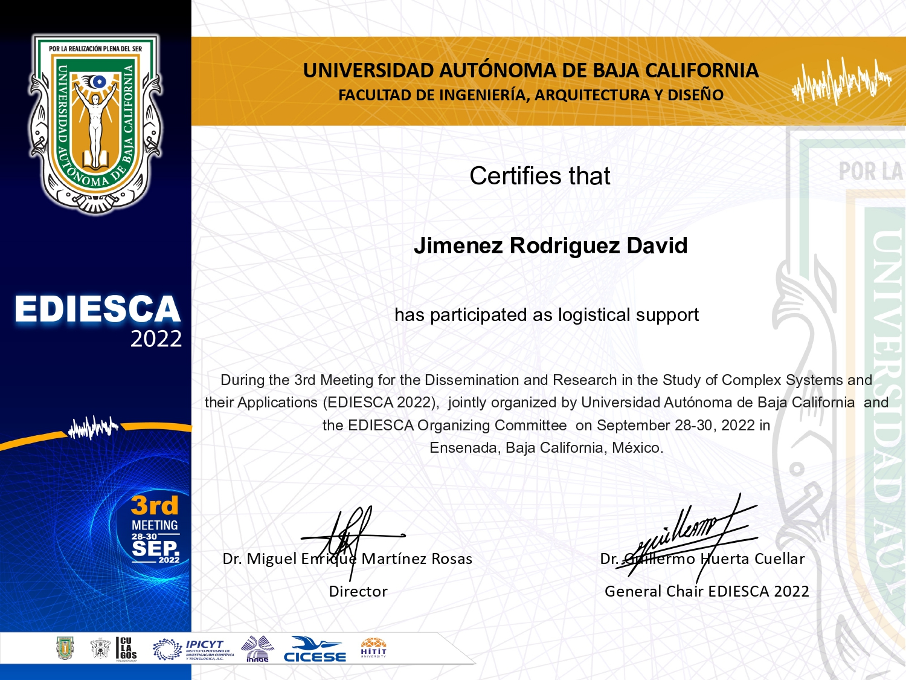
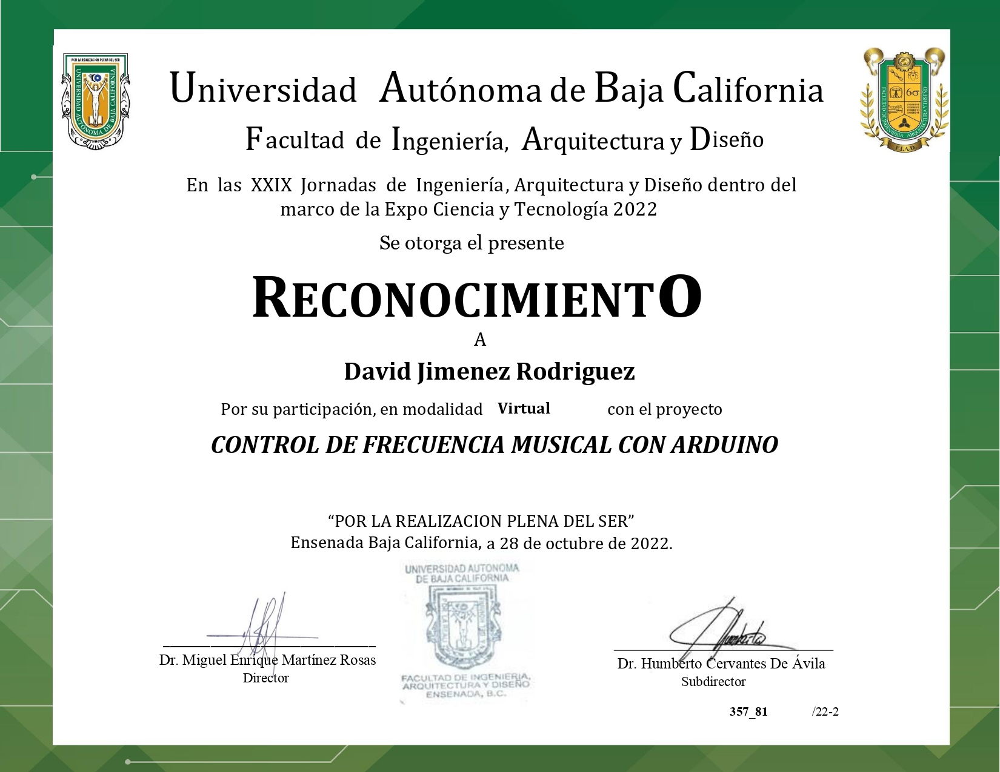
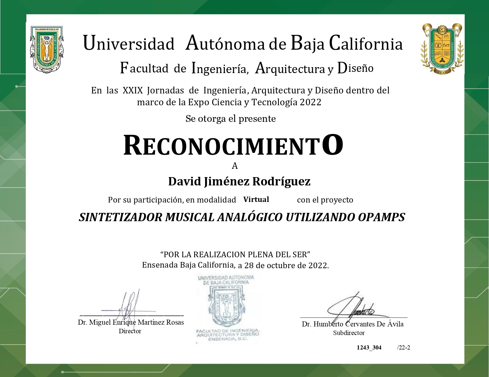

# Certificates
[Ver en español](readme_es.md)
## Machine Learning Specialization (Coursera, Stanford University & deeplearning.ai)
Implementation of **supervised machine learning** models like linear and logistic regression, neural networks and decision trees and **unsupervised** models like clustering and anomaly detection, recommender systems and reinforcement learning.

  

## 5 Weeks of Data Science (AI Planet)
Basic/intermediate use of Python **data modules** like numpy, pandas, matplotlib and seaborn for **data cleaning, manipulation** and **visualization**, and implementation of **machine learning** models using libraries like scikit-learn and XGBoost.

  

## 5 Weeks of Deep Learning (AI Planet)
Basic/intermediate use of **deep learning** modules like TensorFlow and Keras and implementation of **vanilla** and **convolutional neural networks** for image classification tasks.

  

## Congreso EDIESCA 2022 (UABC)
Support in the logistics of the Dissemination and Research in the Study of **Complex Systems** and their Applications congress (EDIESCA) hosted by the Autonomous University of Baja California (UABC).

  

## Expo Ciencia 2022 (UABC)
Participation in UABC's annual Expo Ciencia y Tecnologia, developing three projects regarding **musical technology, analog** and **digital circuit design**, **music synthesis** and **control systems**.

  
  
  

