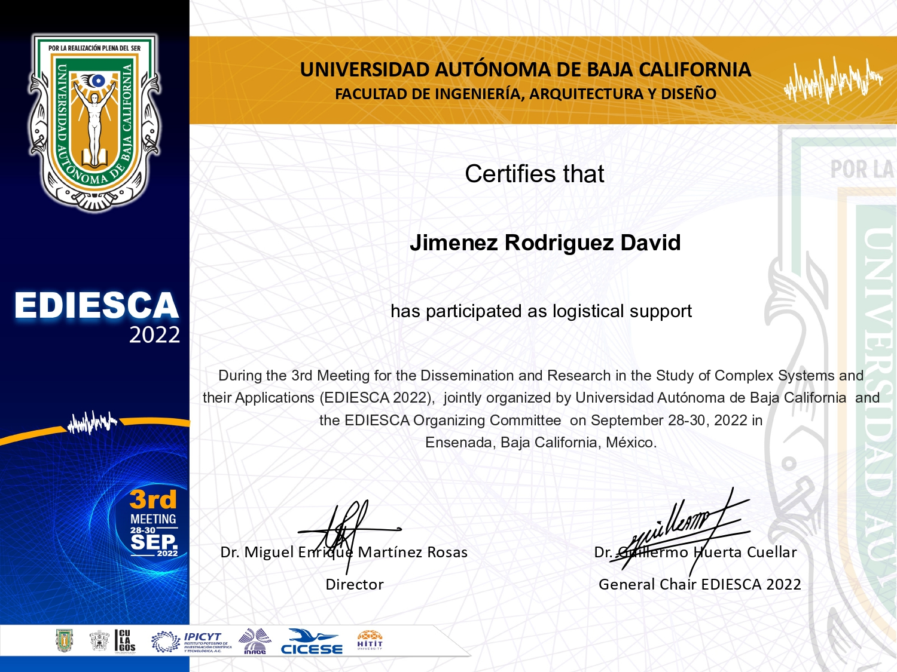

# Certificados

## Machine Learning Specialization (Coursera, Stanford University & deeplearning.ai)
Implementación práctica de modelos de **aprendizaje automático supervisado** como regresion lineal y logistica, redes neuronales y árboles de decisión y  modelos **no supervisados** como agrupamiento y deteccion de anomalias, sistemas de recomendación y aprendizaje por refuerzo.

  

## 5 Weeks of Data Science (AI Planet)
Uso basico/intermedio de librerias de Python para la **ciencia de datos** como numpy, pandas, matplotlib y seaborn para **limpieza, manipulación** y **visualización** de datos, asi como implementación práctica de modelos de aprendizaje automático utilizando librerias como scikit-learn y XGBoost.

  

## 5 Weeks of Deep Learning (AI Planet)
Uso básico/intermedio de librerias de **aprendizaje profundo** como TensorFlow y Keras para la implementación de **redes neuronales vanilla** y **convolucionales** para clasificación de imágenes

  

## Congreso EDIESCA 2022 (UABC)
Apoyo en la logistica detras del congreso internacional Encuentro para la Divulgación e Investigación en el Estudio de **Sistemas Complejos** y sus Aplicaciones (EDIESCA), organizado por la Universidad Autónoma de Baja California (UABC).

  

## Expo Ciencia 2022 (UABC)
Participación en la Expo Ciencia y Tecnología de la UABC, desarrollando tres proyectos sobre **tecnología musical, diseño de circuitos digitales** y **analógicos**, **síntesis musical** y **sistemas de control**.

  
  
  

